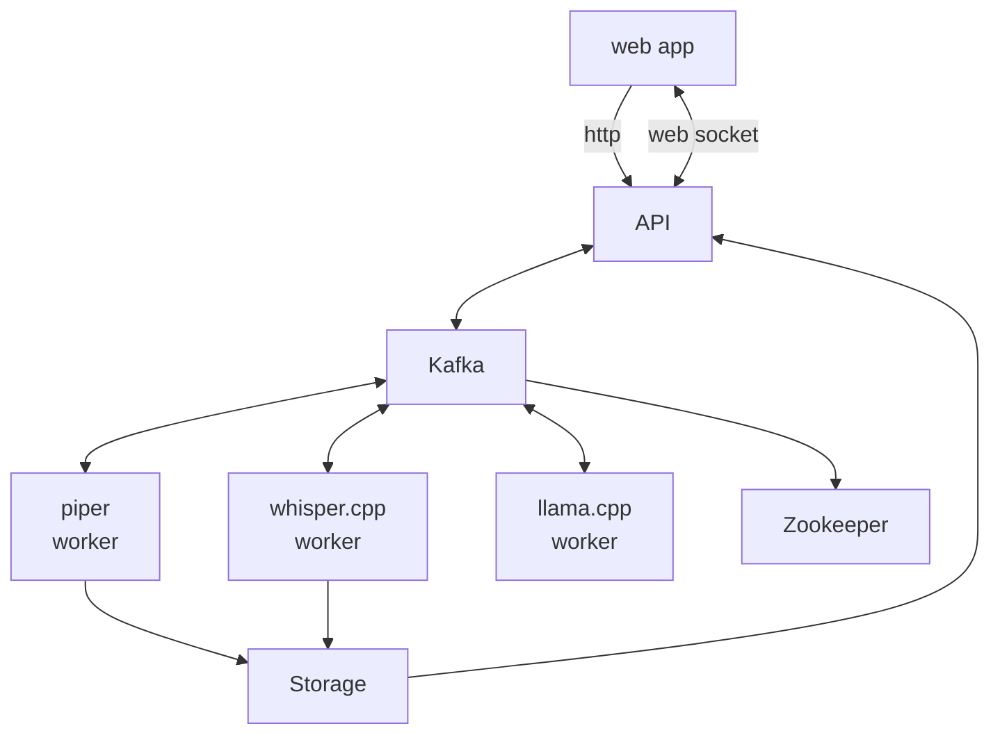

# metatron

Metatron is a project that brings together `whisper.cpp`, `llama.cpp`, and `piper` into a deployable stack with an awesome Node.js API wrapper for each of them.

Why? So you can deploy and scale out each part in your own network, and use the API to interact with them:
* Send audio through the whisper API for a transcription
* Send a prompt through llama API for a response
* Send a response through piper API for text-to-speech audio

## Usage

```shell
# Builds the images from local Dockerfiles
./localdev_build.sh
# Starts the Docker Compose project with a screen session to the web server and background workers
./localdev_start.sh
```

```shell
git submodule update --init --recursive
cd piper && docker buildx build --target build -t piper:latest .

# for local development
docker build --target localdev -t metatron-api:localdev -f ./Dockerfile-api .
docker build --target localdev -t metatron-piper:localdev -f ./Dockerfile-piper .
docker build --target localdev -t metatron-llama:localdev -f ./Dockerfile-llama .
docker build --target localdev -t metatron-whisper:localdev -f ./Dockerfile-whisper .
docker compose up

# for production
docker build -t metatron-api:latest -f ./Dockerfile-api .
docker build -t metatron-piper:latest -f ./Dockerfile-piper .
docker build -t metatron-llama:latest -f ./Dockerfile-llama .
docker build -t metatron-whisper:latest -f ./Dockerfile-whisper .
```

Debugging:

```shell
docker build -t metatron --no-cache .
```

## Architecture



### Data Flow

1. API generates a UUID for the request:
   * callback topic is `metatron-response-${UUID}`
   * API subscribes to the callback topic:
     * when a message is received, it is sent to the client via web socket
     * when a message is received, it is deleted from the topic
       * the transcription will be displayed in the web app
       * the prompt and response will be displayed in the web app
       * the synthesized audio will be played in the web app
2. API sends message to `transcribe` topic with:
   * UUID
   * audio file id
   * callback topic
3. Whisper worker consumes message from `transcribe` topic
4. Whisper worker sends message to callback topic with:
   * UUID
   * transcription data
5. API sends message to `prompt` topic with:
   * UUID
   * prompt data
   * callback topic
6. Llama worker consumes message from `prompt` topic
7. Llama worker sends message to callback topic with:
   * UUID
   * response data
8. API sends message to `synthesize` topic with:
   * UUID
   * response data
   * callback topic
9. Piper worker consumes message from `synthesize` topic
10. Piper worker uploads audio to storage
11. Piper worker sends message to callback topic with:
    * UUID
    * audio file id
