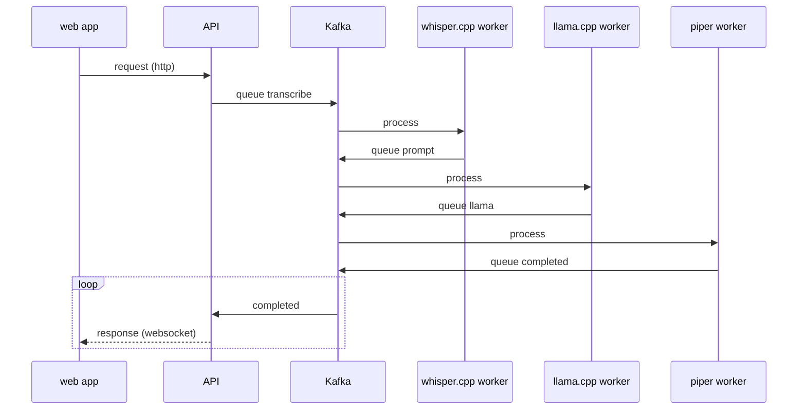
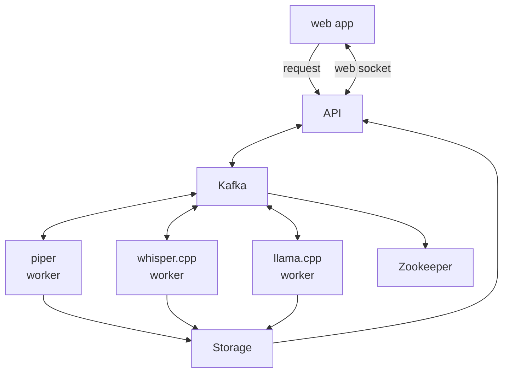

# metatron

Metatron is a project that brings together `whisper.cpp`, `llama.cpp`, and `piper` into a deployable stack with an awesome Node.js API wrapper for each of them.

Why? So you can deploy and scale out each part in your own network, and use the API to interact with them:
* Send audio through the whisper API for a transcription
* Send a prompt through llama API for a response
* Send a response through piper API for text-to-speech audio

## Usage

```
git submodule update --init --recursive
cd piper && docker buildx build --target build -t piper:latest .

# for local development
docker build --target localdev -t metatron-api:localdev -f ./Dockerfile-api .
docker build --target localdev -t metatron-piper:localdev -f ./Dockerfile-piper .
docker build --target localdev -t metatron-llama:localdev -f ./Dockerfile-llama .
docker build --target localdev -t metatron-whisper:localdev -f ./Dockerfile-whisper .
docker compose up

# for production
docker build -t metatron-api:latest -f ./Dockerfile-api .
docker build -t metatron-piper:latest -f ./Dockerfile-piper .
docker build -t metatron-llama:latest -f ./Dockerfile-llama .
docker build -t metatron-whisper:latest -f ./Dockerfile-whisper .
```

Debugging:
```
docker build -t metatron --no-cache .
```

## Architecture



